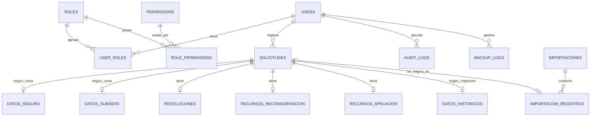

# DISEÑO DE BASE DE DATOS

> Estado: **FASE 1 — ANÁLISIS / diseño propuesto** | Fecha: 2026-09-24
> Motor: **PostgreSQL** (proveedor **Neon**). Migraciones: **Alembic**.
> Regla: la BD puede normalizarse, pero debe (1) mantener todos los datos, (2) respetar el flujo, (3) no perder información y (4) no alterar los requerimientos.

---

## 1. Principios

1. **Los 33 campos del formulario se almacenan íntegramente**; la normalización es técnica e interna (el API expone exactamente los 33 campos agrupados por bloques).
2. **El histórico se conserva íntegro**: se habilita una tabla de extensión histórica para las columnas de `antes.xlsx` que no existen en el formulario nuevo (regla: "NO eliminar columnas históricas").
3. **Los valores de catálogo** (SEGURO/SUBSIDIO, riesgos, decisiones, medios) se validan junto a los CHECK constraints, **excepto** cuando un dato histórico no se ajusta al catálogo; en ese caso el valor original vive en la tabla histórica y no bloquea la migración (regla: no poner restricciones que bloqueen la migración antes de analizar datos).
4. Los campos con ceros a la izquierda son `VARCHAR`: NIT, EXP SGD, RUC, DNI/C.E., DNI receptor, Nº Resolución, Nº Nota de Derivación. Las fechas son `DATE`.

---

## 2. Modelo conceptual

---

## 3. Esquema de tablas (propuesta de diseño)

### 3.1 Seguridad y administración

**`roles`**

| Columna | Tipo | Notas |
|---|---|---|
| id | BIGSERIAL PK | |
| nombre | VARCHAR(50) UNIQUE NOT NULL | `SUPERADMIN`, `ADMIN`, `OPERADOR`, `CONSULTA` |
| descripcion | VARCHAR(255) | |
| created_at / updated_at | TIMESTAMPTZ | |

**`permissions`**

| Columna | Tipo | Notas |
|---|---|---|
| id | BIGSERIAL PK | |
| codigo | VARCHAR(100) UNIQUE NOT NULL | ej. `CREAR_SOLICITUD`, `GESTIONAR_USUARIOS`, `RESPALDAR` |
| descripcion | VARCHAR(255) | |

**`role_permissions`** — FK compuesta a `roles` y `permissions`; UNIQUE(role_id, permission_id).

**`users`**

| Columna | Tipo | Notas |
|---|---|---|
| id | BIGSERIAL PK | |
| usuario | VARCHAR(50) UNIQUE NOT NULL | |
| password_hash | VARCHAR(255) NOT NULL | Nunca texto plano |
| nombres | VARCHAR(100) | |
| apellidos | VARCHAR(100) | |
| email | VARCHAR(150) | opcional |
| is_active | BOOLEAN NOT NULL DEFAULT TRUE | activo/desactivable por SUPERADMIN |
| created_at / updated_at | TIMESTAMPTZ | |

**`user_roles`** — FK a `users` y `roles`; UNIQUE(user_id, role_id).

### 3.2 Núcleo del acto administrativo

**`solicitudes`** (información principal, pasos 2–8)

| Columna | Tipo | Notas |
|---|---|---|
| id | BIGSERIAL PK | |
| nit | VARCHAR(50) NOT NULL | Formato `XXXX-XXXX-NIT-XXXXXXX` para datos nuevos; histórico conserva texto literal |
| exp_sgd | VARCHAR(16) NOT NULL | 16 dígitos iniciando en 0 |
| fecha_recepcion | DATE NOT NULL | Paso 4 |
| ruc | VARCHAR(11) NOT NULL | 11 dígitos, texto |
| entidad_empleadora | VARCHAR(50) NOT NULL | |
| dni_ce | VARCHAR(10) NOT NULL | 5–10 alfanuméricos, cero inicial válido |
| asegurado_titular | VARCHAR(50) NOT NULL | |
| tipo_tramite | VARCHAR(10) NOT NULL | CHECK IN (`SEGURO`,`SUBSIDIO`) |
| origen | VARCHAR(20) NOT NULL DEFAULT 'REGISTRO' | `REGISTRO` / `MIGRACION` (trazabilidad, no altera requerimientos) |
| created_by / updated_by | FK users | |
| created_at / updated_at | TIMESTAMPTZ | |

Índices: UNIQUE (exp_sgd); índice en nit, dni_ce, asegurado_titular (búsquedas — ver §5). Se define `exp_sgd` UNIQUE salvo que el análisis de migración encuentre duplicados reales (se evalúa en DRY RUN; en ese caso pasa a índice no único con decisión documentada).

**`datos_seguro`** (pasos 10–11; MOTIVO opcional — DP-03)

| Columna | Tipo | Notas |
|---|---|---|
| id | BIGSERIAL PK | |
| solicitud_id | BIGINT FK UNIQUE NOT NULL | 1 solicitud : 0..1 datos seguro |
| riesgo | VARCHAR(40) NOT NULL | CHECK IN (`ALTA TITULAR`,`ALTA DERECHOHABIENTE`,`CONDICION DEL ASEGURADO`,`AUDITORIA`,`FISCALIZACION POSTERIOR`,`BAJA TITULAR`,`BAJA DERECHOHABIENTE`,`LACTANCIA`,`ENFERMEDAD`) |
| decision_resolucion | VARCHAR(30) NOT NULL | CHECK IN (`BAJA DE OFICIO`,`RESOLUCION DE MULTA`) |
| motivo | VARCHAR(100) NULL | Paso 12, cuando corresponda |

**`datos_subsidio`** (pasos 12–15)

| Columna | Tipo | Notas |
|---|---|---|
| id | BIGSERIAL PK | |
| solicitud_id | BIGINT FK UNIQUE NOT NULL | |
| motivo | VARCHAR(100) NOT NULL | Paso 12 |
| riesgo | VARCHAR(40) NOT NULL | CHECK IN (`LACTANCIA`,`ENFERMEDAD`,`MATERNIDAD`,`SEPELIO`,`REINTEGRO`,`FISCALIZACION POSTERIOR`) |
| decision_resolucion | VARCHAR(30) NOT NULL | CHECK IN (`BAJA DE OFICIO`,`DENEGATORIA`,`IMPROCEDENTE`,`EN PARTE`) |

**`resoluciones`** (pasos 16–22)

| Columna | Tipo | Notas |
|---|---|---|
| id | BIGSERIAL PK | |
| solicitud_id | BIGINT FK UNIQUE NOT NULL | |
| numero_resolucion | VARCHAR(4) NOT NULL | 4 dígitos con ceros (`0012`) — texto |
| anio | SMALLINT NOT NULL | año editable, por defecto actual |
| fecha_emision | DATE NOT NULL | |
| fecha_notificacion | DATE NOT NULL | |
| medio_comunicacion | VARCHAR(15) NOT NULL | CHECK IN (`CORREO`,`PRESENCIAL`,`VIRTUAL`) |
| dni_recepciona | VARCHAR(10) NOT NULL | 5–10 alfanuméricos |
| apellidos_nombres | VARCHAR(50) NOT NULL | |

**`recursos_reconsideracion`** (pasos 23–31)

| Columna | Tipo | Notas |
|---|---|---|
| id | BIGSERIAL PK | |
| solicitud_id | BIGINT FK UNIQUE NOT NULL | El recurso se vincula; no duplica el trámite |
| fecha_recepcion | DATE NOT NULL | |
| numero_resolucion | VARCHAR(4) NOT NULL | 4 dígitos |
| anio | SMALLINT NOT NULL | año actual editable |
| fecha_emision | DATE NOT NULL | |
| decision_resolucion | VARCHAR(15) NOT NULL | CHECK IN (`FUNDADO`,`INFUNDADO`,`EN PARTE`) |
| fecha_notificacion | DATE NOT NULL | |
| medio_comunicacion | VARCHAR(15) NOT NULL | CHECK IN (`CORREO`,`PRESENCIAL`,`VIRTUAL`) |
| dni_recepciona | VARCHAR(10) NOT NULL | |
| apellidos_nombres | VARCHAR(50) NOT NULL | |

**`recursos_apelacion`** (pasos 32–34)

| Columna | Tipo | Notas |
|---|---|---|
| id | BIGSERIAL PK | |
| solicitud_id | BIGINT FK UNIQUE NOT NULL | |
| fecha_recepcion | DATE NOT NULL | |
| numero_nota_derivacion | VARCHAR(6) NOT NULL | 6 dígitos (`000012`) — texto |
| fecha_nota | DATE NOT NULL | |

### 3.3 Histórico (migración de `antes.xlsx`)

**`importaciones`**

| Columna | Tipo | Notas |
|---|---|---|
| id | BIGSERIAL PK | |
| nombre_archivo | VARCHAR(255) NOT NULL | |
| modo | VARCHAR(10) NOT NULL | `DRY_RUN` / `CONFIRMADA` |
| estado | VARCHAR(20) | `ANALIZADO`, `VALIDADO`, `PREVISTO`, `IMPORTADO`, `CANCELADO` |
| registros_leidos / validos / con_errores | INT | |
| hash_archivo | VARCHAR(64) | detección de reimportación |
| creada_por FK users, created_at | | |

**`importacion_registros`** — registro por fila leída del Excel con estado (`OK`, `ERROR`, `ADVERTENCIA`), mensajes, e `id_solicitud` cuando se inserta.

**`datos_historicos`** (extensión: columnas de `antes.xlsx` no contempladas en el formulario nuevo)

| Columna | Tipo | Notas |
|---|---|---|
| id | BIGSERIAL PK | |
| solicitud_id | BIGINT FK UNIQUE NULL | vínculo cuando el registro sí se carga al núcleo |
| importacion_registro_id | BIGINT FK | trazabilidad de origen |
| correo | VARCHAR(255) | |
| telefono | VARCHAR(30) | |
| comunicado_whatsapp | VARCHAR(255) | |
| autorizacion_expresa | VARCHAR(255) | |
| direccion_formulario | VARCHAR(255) | |
| distrito / provincia / departamento | VARCHAR(100) | |
| nro_sobre | VARCHAR(50) | |
| fecha_sobre | DATE | encabezado original extendido (DP-10) |
| fecha_notificacion_historica | DATE | coincide con paso 19 pero origen histórico |
| estado_notificacion | VARCHAR(255) | texto libre (DP-04) |
| nota_cargo | VARCHAR(500) | columna sin encabezado (DP-11) |
| rotulo_file | VARCHAR(255) | |
| decision_resolucion_extra | VARCHAR(255) | 2ª columna "Decisión Resolución" (vacía) |
| tipo_subsidio | VARCHAR(150) | |
| ruc_dni_beneficiario | VARCHAR(30) | |
| monto | NUMERIC(12,2) NULL | |
| motivo_resolucion | VARCHAR(150) | |
| observaciones | TEXT | |
| plazo_espera_dias | VARCHAR(100) | texto (leyenda del encabezado) |
| fecha_derivarse_calificador | DATE | valor calculado de fórmula (leído con data_only) |
| fecha_entregado_calificador | DATE | |
| fila_excel | INT | fila original |
| nit_original / exp_sgd_original | VARCHAR(50) | valores literales pre-normalización (DP-01/02) |
| creado_at | TIMESTAMPTZ | |

> Esta tabla garantiza que **ninguna columna histórica se elimina** y que el dato original nunca se altera silenciosamente.

### 3.4 Auditoría y respaldos

**`audit_logs`**

| Columna | Tipo | Notas |
|---|---|---|
| id | BIGSERIAL PK | |
| user_id | FK users NULL | |
| accion | VARCHAR(50) | `LOGIN`, `CREAR_SOLICITUD`, `EDITAR_SOLICITUD`, `CREAR_RESOLUCION`, `EDITAR_RESOLUCION`, `CREAR_RECONSIDERACION`, `CREAR_APELACION`, `CREAR_USUARIO`, `EDITAR_USUARIO`, `CAMBIAR_ROL`, `BACKUP`, ... |
| entidad | VARCHAR(50) | |
| registro_id | BIGINT | id del registro afectado |
| informacion_anterior | JSONB | |
| informacion_nueva | JSONB | |
| ip / user_agent | VARCHAR | opcional |
| created_at | TIMESTAMPTZ | |

Índice: (entidad, registro_id), (user_id, created_at), (accion, created_at).

**`backup_logs`**

| Columna | Tipo | Notas |
|---|---|---|
| id | BIGSERIAL PK | |
| tipo | VARCHAR(20) | `MANUAL`, `PERIODICO` |
| estado | VARCHAR(20) | `EXITOSO`, `FALLIDO` |
| archivo_nombre / archivo_url | VARCHAR(255) | almacenamiento seguro |
| tamano_bytes | BIGINT | |
| fecha_inicio / fecha_fin | TIMESTAMPTZ | |
| creado_por FK users NULL (manual) | | |

---

## 4. Justificación de la normalización

- **`solicitudes` + `datos_seguro`/`datos_subsidio`**: `TIPO DE TRAMITE` es excluyente (SEGURO o SUBSIDIO); modelar ambas ramas en columnas de una sola tabla las dejaría siempre con la mitad nula y exigiría CHECK cruzados. Las tablas hijas con `UNIQUE(solicitud_id)` garantizan 0..1 por solicitud sin perder ningún campo (pasos 10–15 completos).
- **`resoluciones`, `recursos_reconsideracion`, `recursos_apelacion` separadas**: reflejan la jerarquía conceptual Solicitud→Resolución→Recurso (§7 de `FLUJO_PROCESO.md`) y permiten auditoría/granularidad de permisos por bloque (`CREAR_RESOLUCION`, `CREAR_RECONSIDERACION`, `CREAR_APELACION`).
- **`datos_historicos`**: separa el histórico de los datos operativos, evita que constraint de catálogo bloqueen la migración y conserva columnas que no pertenecen al formulario de 33 campos.
- **`importaciones`/`importacion_registros`**: soporta el pipeline con DRY RUN exigido (§4.6 de `ANALISIS_REQUERIMIENTOS.md`).
- A nivel de API, cada endpoint del grupo actos trabaja con la vista completa: una solicitud se reconstruye con su rama, resolución y recursos.

---

## 5. Índices y constraints principales

- UNIQUE en `solicitudes.exp_sgd` (matrícula del trámite).
- Índices para búsqueda (criterios: NIT, EXP SGD, DNI/C.E., Asegurado titular y combinaciones fecha-rango para reportes):
  - `ix_solicitudes_nit`, `ix_solicitudes_dni_ce`, `ix_solicitudes_asegurado_titular`, `ix_solicitudes_fecha_recepcion`.
- CHECK constraints de catálogo donde corresponde (sección 3).
- FK con `ON DELETE RESTRICT` en el núcleo (nada se borra silenciosamente).
- `audit_logs` con índices por entidad/registro y por usuario/fecha.
- Transacciones en todas las operaciones de escritura (service layer).

---

## 6. Integración de datos históricos (resumen)

1. DRY RUN lee `antes.xlsx`, valida y presenta vista previa sin insertar.
2. Los registros que cumplen el núcleo se insertan a `solicitudes` (+ rama/resolución si se puede mapear de forma segura).
3. Todos los datos literales y columnas adicionales se guardan en `datos_historicos` (sin excepción).
4. Discrepancias de formato (NIT, Nº Resolución, valores de decisión, `EN`/`MA`) se mantienen literales y se documentan por fila.
5. No se inferirán recursos (reconsideración/apelación) desde el histórico sin aprobación (DP-08).

Detalle completo en `MIGRACION.md`.

---

## 7. Orden de ejecución (Alembic)

1. `roles`, `permissions`, `role_permissions`, `users`, `user_roles`.
2. `solicitudes`, `datos_seguro`, `datos_subsidio`, `resoluciones`, `recursos_reconsideracion`, `recursos_apelacion`.
3. `importaciones`, `importacion_registros`, `datos_historicos`.
4. `audit_logs`, `backup_logs`.
5. Seed inicial: roles y permisos base (ver `RBAC.md`).

**Nota:** la estructura definitiva quedará fijada en el primer migration de Alembic; este documento es la base de diseño aprobada para FASE 2.