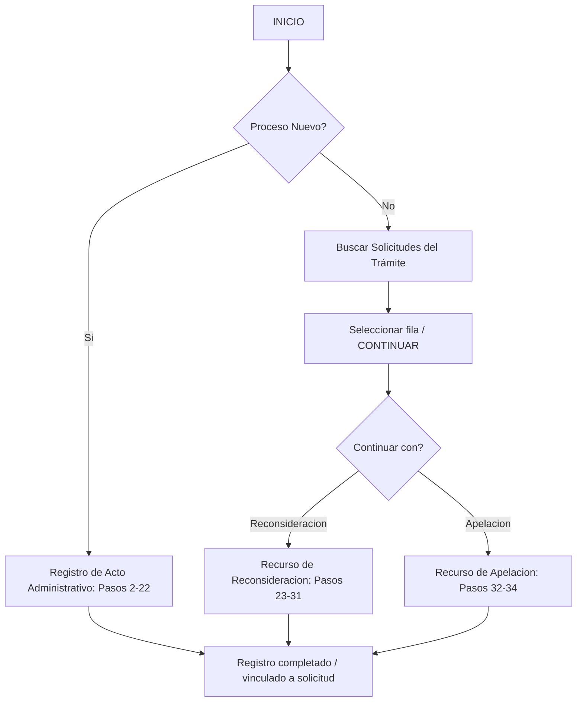

# FLUJO DEL PROCESO — SISTEMA DE GESTIÓN DE ACTOS ADMINISTRATIVOS

> Estado: **FASE 1 — ANÁLISIS** | Fecha: 2026-09-24
> Este documento describe el flujo funcional exigido por la empresa. No se altera la lógica del documento original.

---

## 1. Flujo general



> (El diagrama usa sintaxis Mermaid; en editores sin soporte se ve el texto equivalente más abajo.)

---

## 2. Paso 1 — ¿PROCESO NUEVO?

Pantalla inicial del módulo de Actos Administrativos:

```
¿PROCESO NUEVO?
○ SI
○ NO
```

- **SI** → inicia el registro de un acto administrativo nuevo (sección 3).
- **NO** → pantalla de búsqueda (sección 5). No se crea un registro.

---

## 3. Registro nuevo — flujo principal (pasos 2–22)

Los campos se presentan en orden, guiando al usuario paso a paso. No se muestran simultáneamente los campos de Seguro y Subsidio: el bloque mostrado depende de `TIPO DE TRÁMITE`.

### 3.1 Pasos comunes (2–8)

| Paso | Campo | Validación | Tipo |
|---|---|---|---|
| 2 | NIT | Formato `XXXX-XXXX-NIT-XXXXXXX`; relleno de ceros a la izquierda en el último grupo (`12 → 0000012`) | Texto, formato asistido |
| 3 | EXP SGD | Exactamente 16 números, inicia en 0 | Texto |
| 4 | FECHA DE RECEPCIÓN | `DD/MM/YYYY` | DATE |
| 5 | RUC | Exactamente 11 números | Texto |
| 6 | ENTIDAD EMPLEADORA | Máx. 50 caracteres | Texto |
| 7 | DNI/C.E. | 5–10 alfanuméricos (ceros a la izquierda válidos) | Texto |
| 8 | ASEGURADO TITULAR | Máx. 50 caracteres | Texto |
| 9 | TIPO DE TRÁMITE | `SEGURO` o `SUBSIDIO` | Selección cerrada |

### 3.2 Rama SEGURO (pasos 10–11, luego 16 en adelante)

```
TIPO DE TRÁMITE = SEGURO
   10. RIESGO SEGURO
   11. DECISIÓN DE RESOLUCIÓN (SEGURO)
          ↓ salta a paso 16
```

| Paso | Campo | Opciones permitidas (cerradas) |
|---|---|---|
| 10 | RIESGO SEGURO | `ALTA TITULAR`, `ALTA DERECHOHABIENTE`, `CONDICION DEL ASEGURADO`, `AUDITORIA`, `FISCALIZACION POSTERIOR`, `BAJA TITULAR`, `BAJA DERECHOHABIENTE`, `LACTANCIA`, `ENFERMEDAD` |
| 11 | DECISIÓN DE RESOLUCIÓN (SEGURO) | `BAJA DE OFICIO`, `RESOLUCION DE MULTA` |

> Paso 12 `MOTIVO`: existe como campo en `BD_ACTOS.xlsm` y en el requerimiento ("cuando corresponda"); el flujo SEGURO documentado salta del paso 11 al 16. Ver **DP-03** en `ANALISIS_REQUERIMIENTOS.md`. En el formulario SEGURO el campo MOTIVO se presenta sin obligatoriedad hasta confirmación del cliente.

### 3.3 Rama SUBSIDIO (pasos 12–14, luego 16 en adelante)

```
TIPO DE TRÁMITE = SUBSIDIO
   12. MOTIVO
   13. RIESGO SUBSIDIO
   14. DECISIÓN DE RESOLUCIÓN (SUBSIDIO)
          ↓ salta a paso 16
```

| Paso | Campo | Opciones permitidas (cerradas) |
|---|---|---|
| 12 | MOTIVO | Máx. 100 caracteres (texto) |
| 13 | RIESGO SUBSIDIO | `LACTANCIA`, `ENFERMEDAD`, `MATERNIDAD`, `SEPELIO`, `REINTEGRO`, `FISCALIZACION POSTERIOR` |
| 14 | DECISIÓN DE RESOLUCIÓN (SUBSIDIO) | `BAJA DE OFICIO`, `DENEGATORIA`, `IMPROCEDENTE`, `EN PARTE` |

### 3.4 Bloque común: resolución del acto (pasos 16–22)

Ambos flujos continúan con el mismo bloque:

| Paso | Campo | Validación |
|---|---|---|
| 16 | Nº RESOLUCIÓN | 4 números; relleno con ceros (`12 → 0012`, `5 → 0005`, `123 → 0123`, `1234 → 1234`); texto |
| 17 | AÑO | Año actual por defecto (ej. 2026); editable |
| 18 | FECHA DE EMISIÓN | `DD/MM/YYYY` |
| 19 | FECHA DE NOTIFICACIÓN | `DD/MM/YYYY` |
| 20 | MEDIO DE COMUNICACIÓN | `CORREO`, `PRESENCIAL`, `VIRTUAL` |
| 21 | DNI QUIEN RECEPCIONA EL DOCUMENTO | 5–10 alfanuméricos, cero inicial permitido |
| 22 | APELLIDOS Y NOMBRES | Máx. 50 caracteres |

---

## 4. Registro de un recurso sobre trámite existente (pasos 23–34)

Un trámite existente puede continuar con recurso; el recurso queda **relacionado** al acto seleccionado y **no** se duplica el trámite.

### 4.1 Recurso de RECONSIDERACIÓN (pasos 23–31)

| Paso | Campo | Validación |
|---|---|---|
| 23 | FECHA DE RECEPCIÓN | `DD/MM/YYYY` |
| 24 | Nº RESOLUCIÓN | 4 números (`12 → 0012`) |
| 25 | AÑO | Año actual; editable |
| 26 | FECHA DE EMISIÓN | `DD/MM/YYYY` |
| 27 | DECISIÓN DE RESOLUCIÓN | `FUNDADO`, `INFUNDADO`, `EN PARTE` |
| 28 | FECHA DE NOTIFICACIÓN | `DD/MM/YYYY` |
| 29 | MEDIO DE COMUNICACIÓN | `CORREO`, `PRESENCIAL`, `VIRTUAL` |
| 30 | DNI QUIEN RECEPCIONA EL DOCUMENTO | 5–10 alfanuméricos |
| 31 | APELLIDOS Y NOMBRES | Máx. 50 |

### 4.2 Recurso de APELACIÓN (pasos 32–34)

| Paso | Campo | Validación |
|---|---|---|
| 32 | FECHA DE RECEPCIÓN | `DD/MM/YYYY` |
| 33 | Nº DE NOTA DE DERIVACIÓN A SGPE | 6 números (`12 → 000012`, `5 → 000005`, `123456 → 123456`); texto |
| 34 | FECHA DE LA NOTA | `DD/MM/YYYY` |

---

## 5. PROCESO NUEVO = NO → BUSCAR SOLICITUDES DEL TRÁMITE

### 5.1 Criterios de búsqueda

| Criterio | Validación al buscar |
|---|---|
| NIT | Formato `XXXX-XXXX-NIT-XXXXXXX` (en búsqueda se permite el valor tal como se registró; ver DP-01) |
| EXP SGD | 16 números, inicia en 0 |
| DNI/C.E. | 5–10 alfanuméricos |
| ASEGURADO TITULAR | Texto (coincidencia parcial permitida sin inventar reglas nuevas) |

### 5.2 Resultados

- Se muestran las filas coincidentes en una **tabla paginada** (no se carga toda la BD en el navegador).
- Columnas mínimas: NIT, EXP SGD, Fecha de recepción, RUC, Entidad empleadora, DNI/C.E., Asegurado titular, Tipo de trámite, Riesgo, Decisión, Nº Resolución, Año.
- Permite paginación, filtros y ordenamiento.

### 5.3 Selección y continuación

- La fila seleccionada se **resalta** (identificable claramente).
- Botón **CONTINUAR**: identifica el trámite y permite continuar con **RECURSO DE RECONSIDERACIÓN** o **RECURSO DE APELACIÓN**.

---

## 6. Numeración global (regla de la empresa)

1. **Paso 1** — Proceso nuevo.
2. **Pasos 2–22** — Información principal (identificación, trámite, rama Seguro/Subsidio y resolución del acto).
3. **Pasos 23–31** — Recurso de reconsideración.
4. **Pasos 32–34** — Recurso de apelación.

Esta estructura **no se cambia** en el diseño de formularios ni de API. La normalización en base de datos es interna y preserva los datos (ver `BASE_DATOS.md`).

---

## 7. Relación conceptual de datos

```text
SOLICITUD
    ├── TIPO SEGURO ── Datos de Seguro (riesgo, decisión, motivo)
    └── TIPO SUBSIDIO ── Datos de Subsidio (motivo, riesgo, decisión)
    └── RESOLUCIÓN (Nº, Año, fechas, medio, receptor)
           ├── RECONSIDERACIÓN
           └── APELACIÓN
```

La información principal **no se duplica** al crear un recurso: el recurso se vincula a la misma solicitud.

---

## 8. Reglas transversales de UI/UX

- Formulario guiado paso a paso (wizard), no todos los campos a la vez.
- Los campos de Seguro y Subsidio **no** coexisten: se muestran según `TIPO DE TRÁMITE`.
- Visualización de validación al instante (ej. `EXP SGD: Debe contener 16 números y comenzar con 0.`).
- Formateo automático de NIT, Nº Resolución y Nº Nota de Derivación mientras se escribe o al salir del campo.
- Menú del sistema según el rol del usuario (ver `RBAC.md`).